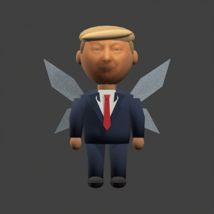
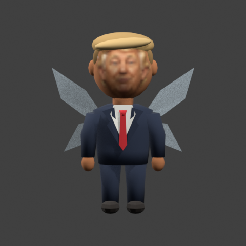
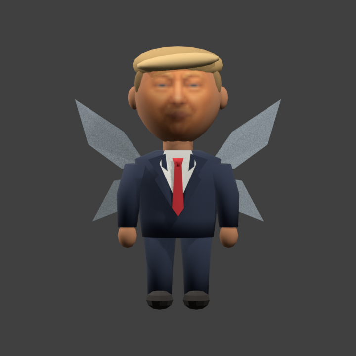

# Ocarina of Trump

Navi is Trump now. That's the idea.

I saw GORM THE OLD's YouTube video about Trump in Hyrule and thought it would
be a funny, dumb thing to turn into a ROM hack. So here's a tiny Trump in a
suit, flying around Hyrule and giving you advice.



*A turntable rendered from the current Blender model. This isn't an in-game screenshot.*

## What's in it

- A Trump fairy model with a talking face. He follows Navi's direction instead
  of always staring at the camera.
- Rewritten English hints and enemy advice, with 177 voice clips and six short
  calls replacing things like “Hey, listen!”
- Navi's name changed to Trump in English dialogue and the C-Up label.
- 29 extra story and warning rewrites. Those aren't fully voiced.
- “Ocarina of Trump” under the Zelda logo on the title screen.

The jokes still leave the actual game hints intact. It's meant to be funny
without making every line the same Trump joke.

## Hear a few clips

These are the actual WAV files used by the game. Click a title to play it in
your browser:

- [▶ Hey, listen](content/voice/trump_cue_call.wav?raw=1) — “Hey, listen. We have a tremendous quest.”
- [▶ The door](content/voice/trump_0201_00.wav?raw=1) — “A door ought to do one thing.”
- [▶ Deku Baba](content/voice/trump_0607_00.wav?raw=1) — “All mouth, no results.”
- [▶ The Shadow Temple boat](content/voice/trump_0183_00.wav?raw=1) — “Would I certify it? I would not.”

## The face needed some work

The old face looked pasted onto his head. We replaced the separate face piece
with one continuous head, gave the nose a proper shape, and simplified the
texture so the skin matches better.

| Earlier Blender model | Current Blender model |
| --- | --- |
|  |  |

[More pictures and a few notes](docs/MODEL.md) · [Full list of changes](content/companion-change-index.md)

## How to play

You'll need your own **NTSC 1.0 Ocarina of Time ROM**. There isn't a ROM download
in this repo. The voice files are already included.

The build uses **WSL Debian, Python 3.10+, and Blender with Fast64**. Our current
setup uses Windows Blender 5.2. Start with the
[setup and build guide](docs/BUILDING.md) if you haven't installed everything.

Once that's set up, run this from the repo folder in Debian:

```bash
export OOT_TRUMP_BLENDER="/mnt/c/Program Files/Blender Foundation/Blender 5.2/blender.exe"
python3 -m oot_trump check-model-tools
./scripts/build-rom.sh "/path/to/your/ntsc-1.0-baserom.z64"
```

Adjust the paths for your computer. Open the finished
`.work/oot/build/ntsc-1.0/oot-ntsc-1.0.z64` in your emulator. Start it fresh;
don't load a save state from an older build.

## Still a work in progress

The ROM builds and all 46 tests pass. The latest audio and facing changes still
need more in-game testing, especially the intro. The wings don't flap, and
other fairies share the replacement model too. Real hardware hasn't been tested.

If something breaks, include your emulator/version, the build you're playing,
and where it happened. [Build help](docs/BUILDING.md#troubleshooting) and
[developer notes](docs/DEVELOPMENT.md) are here if you need them.

## Thanks

GORM THE OLD for the inspiration, [ZeldaRET](https://github.com/zeldaret/oot) for
the decomp, and [Fast64](https://github.com/Fast-64/fast64) for the model tools.

This is an unofficial fan parody. The voice is synthetic, not a real Trump
recording. [Voice credits](content/voice-provenance.json) and
[texture notes](trump_face/README.md) cover the assets. No affiliation or
endorsement is implied. Please don't upload ROMs or extracted game assets here.
