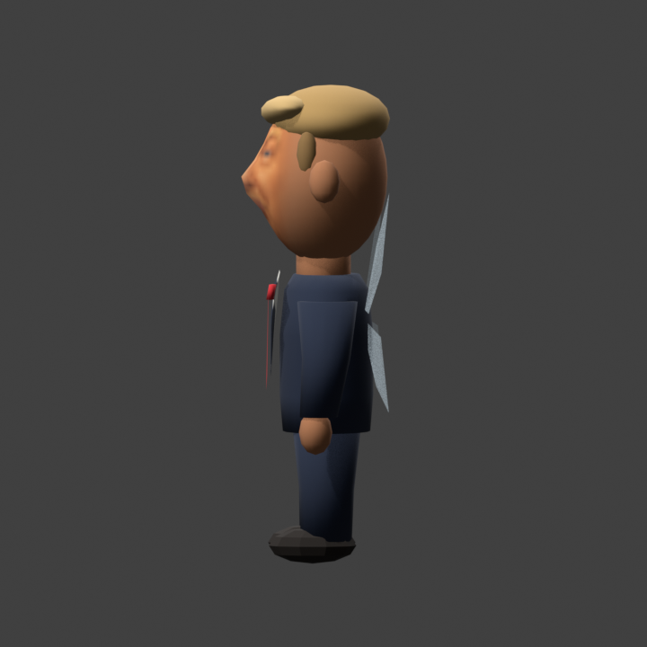

# Fixing the little guy

The first face looked like a picture stuck to a round head. It was especially
obvious from the side. These are Blender renders of the actual model using its
small game textures, not screenshots from an emulator.

## Before and after

| Earlier model | Current model |
| --- | --- |
|  |  |

The face used to be a separate piece over the skull. Now the face and back of
the head share one mesh. The nose has some shape, the jaw is narrower, and the
painted texture doesn't include a second set of hair and ears.

## From the side

The texture meets plain skin at the temples. The ears, neck, and hands use a
color sampled from that edge, so they don't look like a different skin tone.
Both the resting and talking faces still use 32×32 textures to fit the N64.

## How he moves

We tried having him always face the camera. It looked weird, so that's gone.
He now uses Navi's own heading. The mouth changes while a voice clip plays;
the wings are still static. The new heading behavior needs an in-game check.

The current model has 1,349 vertices and 11 materials. For the code and build
details, see [the developer notes](DEVELOPMENT.md).

All pictures here are local Blender renders of this project's parody model.
The earlier image is from the previous head revision; the other three show the
continuous-head revision. [Texture sources and credits](../trump_face/README.md).

[Back to the README](../README.md)
